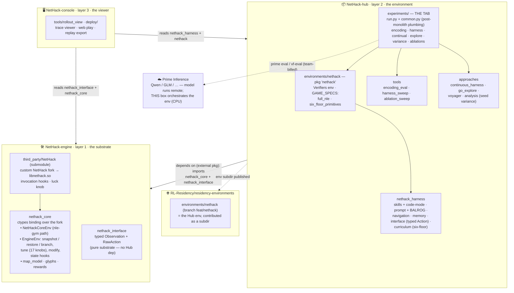

# Architecture — repositories & their functions

The stack is split into three repositories by responsibility, plus the shared
residency registry. Dependencies point **downward** only: the Hub depends on the
engine, the console reads both, and nothing points back up into the Hub (the
engine imports nothing from the Hub — enforced by the coupling fix). Every
experiment runs **post-monolith**: this machine orchestrates the environment
(CPU) and the model is called remotely from Prime Inference.

## Repositories

| Repo | Layer | Function |
|---|---|---|
| **NetHack-engine** (`NetHackHarness`) | 1 · substrate | The controllable NetHack: `nethack_core` (ctypes over the fork → `libnethack.so`; `EngineEnv` with snapshot/restore/**branch**, 17 tune knobs, `modify`, state hooks) + `nethack_interface` (typed `Observation` + `RawAction`). Imports nothing from the Hub. |
| **NetHack-hub** (`NetHack-hub`) | 2 · environment | The training/eval env (`nethack`): skills + code-mode, prompt + BALROG progression, navigation, memory, typed `Action`, the six-floor curriculum; research `approaches/`; eval `tools/`; the **experiments tab**. Depends on the engine as an external package. |
| **NetHack-console** (`NetHack-console`) | 3 · viewer | Rollout viewers, web play, replay export. Reads the engine (`nethack_interface`/`nethack_core`) and the Hub (`nethack_harness`/`nethack`). |
| **residency-environments** (`RL-Residency`) | registry | Shared org repo; the Hub's `environments/nethack/` is contributed as a subdirectory on branch `feat/nethack`. |

## The experiments tab

`experiments/run.py <name> [--smoke | --real]` is the one entry point. Each
experiment is **defined** there and **delegates** to its runner; the shared
post-monolith plumbing (`experiments/common.py`: locate `libnethack.so`, team
billing, `uv`) is not duplicated per experiment. Full write-ups live in
[`docs/experiments/`](experiments/).

| name | Experiment | Runner |
|---|---|---|
| `encoding`  | Exp 1 encoding ablations | `tools/encoding_eval/` |
| `harness`   | Exp 2 harness modifications | `tools/harness_sweep.py` |
| `continual` | Exp 3 continual-harness loop | `approaches/continuous_harness/` |
| `explore`   | Exp 3 go-explore / `branch()` | `approaches/go_explore/` |
| `variance`  | Exp 3 cross-seed variance (6-floor) | `approaches/analysis/seed_variance.py` |
| `ablations` | level-modification ablations | `tools/ablation_sweep.py` |
