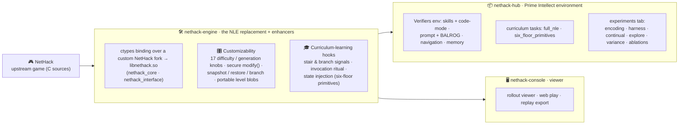

# Architecture — repositories & their functions

Three parts, flowing left to right: the upstream game becomes a controllable
**engine**, which feeds both the **hub** (the Prime Intellect environment) and the
**console** (the viewer).

## The three parts

| Part | What it is |
|---|---|
| **NetHack** | The upstream game (C sources), vendored as the fork submodule. |
| **nethack-engine** | The **NLE replacement**: drives a custom NetHack fork through a ctypes binding (`nethack_core` + `nethack_interface`) instead of the `nle` gym wrapper, and adds the **enhancers** the wrapper structurally can't — **customizability** (17 live difficulty/generation knobs, secure `modify()`, in-memory snapshot/restore/**branch**, portable level blobs) and **curriculum-learning hooks** (stair/branch signals, the invocation ritual, state injection for the six-floor primitives). |
| **nethack-hub** | The **Prime Intellect environment**: the `nethack` Verifiers env (skills + code-mode, prompt + BALROG progression, navigation, memory), the curriculum tasks (`full_nle`, `six_floor_primitives`), and the **experiments tab**. Depends on the engine as an external package. |
| **nethack-console** | The **viewer**: rollout viewer, web play, and replay export. |

Dependencies flow one way — the hub and console build on the engine; the engine
never depends on them.

## The experiments tab

`python -m experiments.run <name> [--smoke | --real]` is the single entry point;
each experiment is defined there and delegates to its runner, all on shared
post-monolith plumbing (`experiments/common.py`). Full write-ups:
[`docs/experiments/`](experiments/).

| name | Experiment | Runner |
|---|---|---|
| `encoding`  | Exp 1 encoding ablations | `tools/encoding_eval/` |
| `harness`   | Exp 2 harness modifications | `tools/harness_sweep.py` |
| `continual` | Exp 3 continual-harness loop | `approaches/continuous_harness/` |
| `explore`   | Exp 3 go-explore / `branch()` | `approaches/go_explore/` |
| `variance`  | Exp 3 cross-seed variance (6-floor) | `approaches/analysis/seed_variance.py` |
| `ablations` | level-modification ablations | `tools/ablation_sweep.py` |
