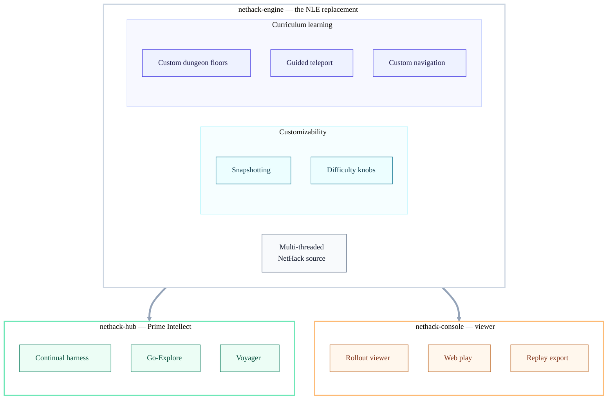

# Architecture — repositories & their functions

`nethack-engine` turns upstream NetHack into a controllable substrate — the NLE
replacement, with customizability and curriculum-learning built in. It powers two
downstream repos: `nethack-hub` (the Prime Intellect environment) and
`nethack-console` (the viewer).

## The three parts

- **nethack-engine** — the NLE replacement. Wraps a custom NetHack fork through a
  ctypes binding and adds what the `nle` wrapper can't: **customizability**
  (in-memory snapshotting, live difficulty knobs) and **curriculum-learning**
  hooks (custom dungeon floors, guided teleport, custom navigation).
- **nethack-hub** — the Prime Intellect environment: the `nethack` Verifiers env
  and the exploration experiments (continual harness, Go-Explore, Voyager).
- **nethack-console** — the viewer: rollout viewer, web play, replay export.

Dependencies flow one way — the hub and console build on the engine; the engine
never depends on them.
